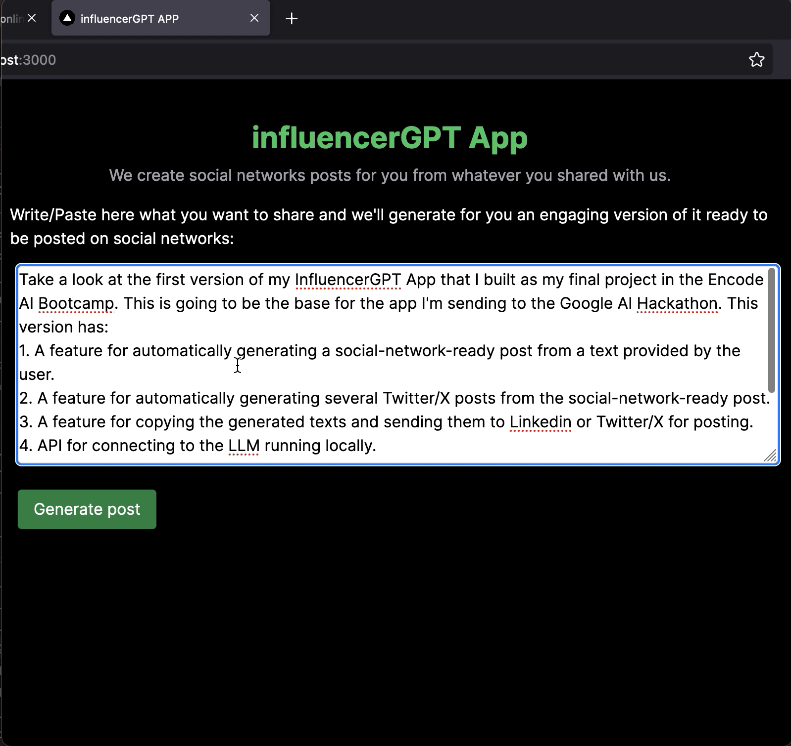
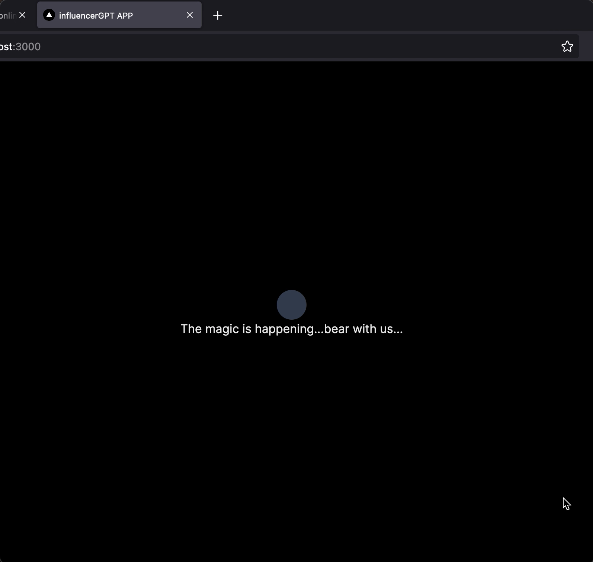
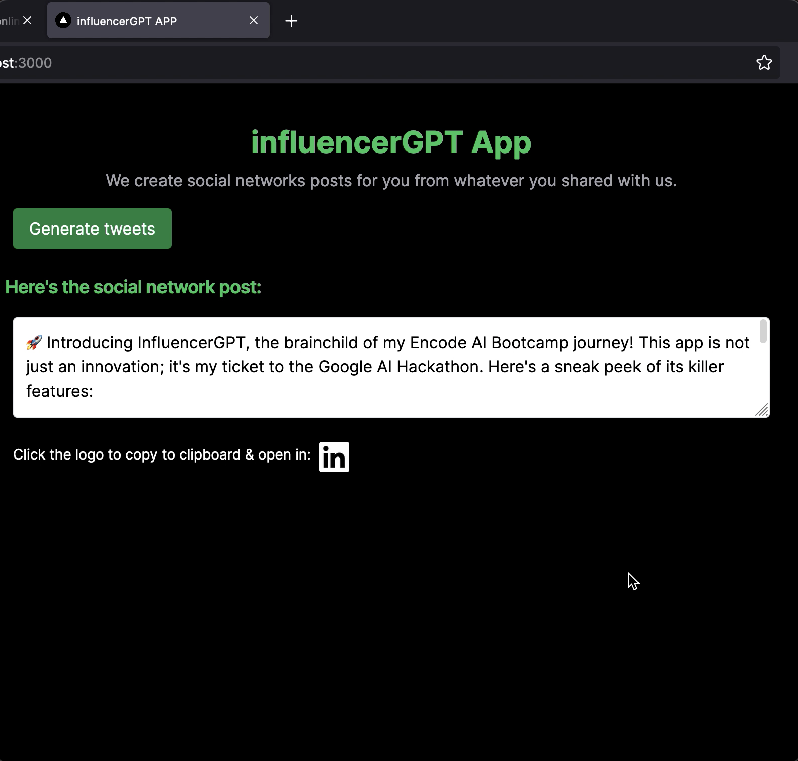
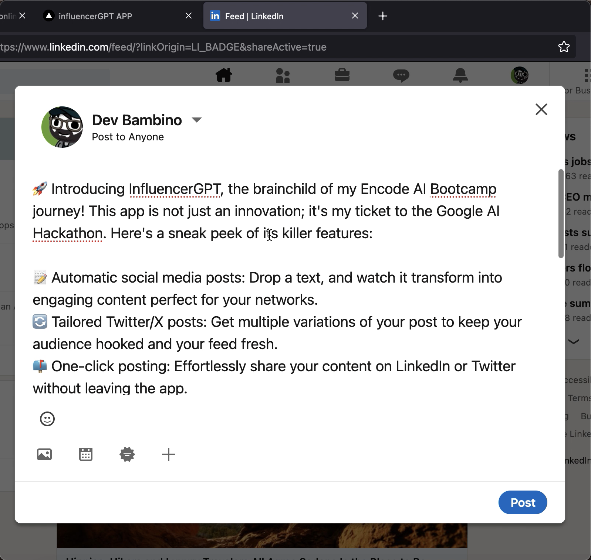
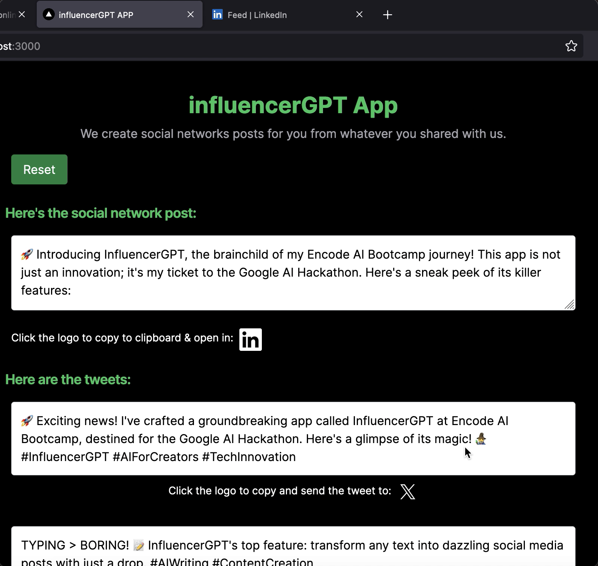
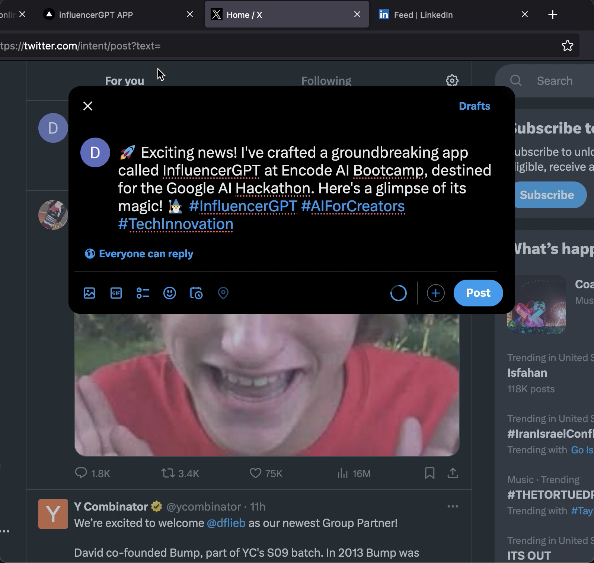

# InfluencerGPT v0
🚀 Introducing InfluencerGPT, the AI sidekick for social media mavens! This innovative app, developed during my Encode Club AI Bootcamp journey, is primed to revolutionize the content creation workflow. 

## Features
Here's what you get:

- 📝 **Automatic Post Generation**: Type in your core message and watch as the app transforms it into captivating social media content.

- 🔄 **Multi-Platform Post Customization**: Get varied Twitter/X post versions from the initial post, optimized for each platform.

- 🌍 **One-Click Posting**: Effortlessly send your polished posts to LinkedIn or Twitter with a single click.

- 🔍 **Local LLM API Integration**: Connect with a powerful WizardLM-2-7B language model for personalized text generation.

- 🎉 **User-Friendly Interface**: Enjoy a responsive web app experience with a sleek, modern design by tailwindCSS.

## Images

## Tech behind

This app is running the connecting locally to the LLM using an API.

### How to install text gen webui

To install text-gen-webui and run the api: 
1) Clone `git clone https://github.com/oobabooga/text-generation-webui` or [download](https://github.com/oobabooga/text-generation-webui/archive/refs/heads/main.zip) the repository.
2) Add to CMD-FLGS.txt: `--model WizardLM-2-7B.Q4_K_M.gguf --api --cpu`
3) Run the `./start_linux.sh`
4) Once the installation ends, browse to `http://localhost:7860/?__theme=dark`.

### Deploy on Vercel

The easiest way to deploy your Next.js app is to use the [Vercel Platform](https://vercel.com/new?utm_medium=default-template&filter=next.js&utm_source=create-next-app&utm_campaign=create-next-app-readme) from the creators of Next.js.

Check out our [Next.js deployment documentation](https://nextjs.org/docs/deployment) for more details.
